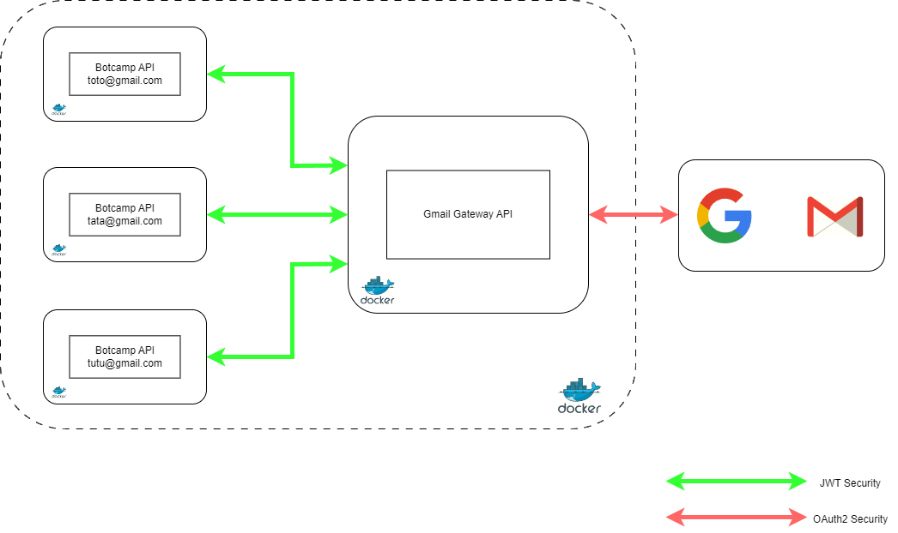

# BotCamp

## Description

Botcamp is a tool allowing users to make reports regarding a specific topic in their mail inbox. The tool will be able to aggregate mails regarding their subject, and will generate mail reports to clean inboxes.
It is possible to schedule auto cleaning and reporting its mailing inbox.

## Architecture

The project will consist in developing a gateway to request Gmail API with Google Java Libraries with Spring Boot, and developing a Botcamp API requesting the gateway, and processing emails.

## Milestones
- [x] Get mails from Gmail
- [ ] Generate reports: it includes the scheduling of automatic report generation
- [ ] Audit feature: Persist reports into database, persist emails. it will be configurable in the scheduled tasks by the user
- [ ] Get mails from more generic API to allow interoperability with non-Gmail users
- [ ] Dockerize application
- [ ] Configure deployment on remote server
